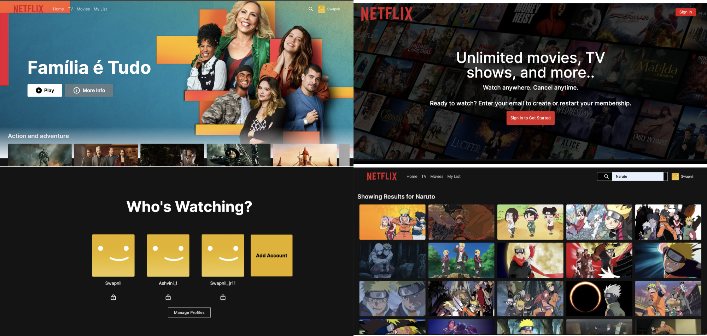

# InsightfulJourney

Welcome to my NexWatch-Studios – A modern streaming service app that provides users with a convenient way to play and watch the latest movies and TV shows available on the internet. With a user-friendly interface and a vast collection of content, NexWatch aims to deliver an exceptional streaming experience to its users.

## Screenshots

## Features
 
- Extensive Library: Access a wide range of movies and TV shows from various genres, including action, drama, comedy, thriller, and more.
- Search and Discover: Easily search for your favorite movies or TV shows using keywords or browse through curated collections to discover new content.
- Personalized Recommendations: Receive tailored recommendations based on your viewing history, and preferences to help you discover new content that suits your taste.
- High-Quality Streaming: Experience high-definition streaming with adaptive streaming technology that adjusts video quality based on your internet connection.

## Tech Stack

- Next.js 13: Harnesses the latest features of Next.js for seamless server-side rendering and client-side interactions.
- MongoDB: Employs MongoDB, a robust NoSQL database, to store user data, movie details, and other relevant information.
- Tailwind CSS: Leverages Tailwind CSS, a utility-first CSS framework, for rapid and flexible styling of components and user interfaces.
- TMDB API Integration: Integrates TMDB (The Movie Database) API to fetch comprehensive movie and TV show data, including descriptions, ratings, trailers, and more.
- NextAuth: Facilitates secure user authentication through NextAuth, ensuring a seamless and reliable login experience for users.

# To run this Blog App on your local machine, follow these steps:

## Prerequisites
Ensure that you have the following installed on your system:

-  Node.js and npm
-  Git

## Clone the Repository:
git clone https://github.com/PatidarAsh/Nexwatch-Studios.git
## Navigate to the Project Directory:

cd Nexwatch-Studios

## Install Dependencies:
npm install

## Set Up Authentication 
- Create Account on your desired Authentication Service  (e.g., Google, GitHub etc.).
- Obtain your CLIENT and SECRET ID from  your chosen service.
- Add them in a .env file at the root of the project directory.

## Movie Database Connection:
- Create an account on TMDB.
- Obtain your API keys.

## Run the Application:
npm run dev

## Access the App:
Open your browser and navigate to http://localhost:3000.

